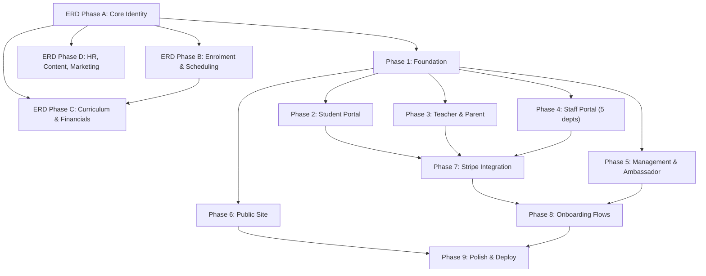

# DivergenCIE Coaching — Full-Stack Implementation Plan v4 (Approved / Final)

> **Goal:** Build a fully functioning, production-ready web platform implementing the **complete ERD v23 (~170 entities)** and all system logic. The system must be capable of **onboarding real users** — students, parents, teachers, staff, ambassadors, and management — with full data flows from enrolment through billing, scheduling, attendance, and reporting.
>
> **Deployment target:** Vercel (user has existing account + project).
> **Database:** PostgreSQL via Neon (serverless).
> **ERD is ground truth.** All other docs (PRD, UJM, MU, BDG) are subordinate.

---

## Resolved Decisions & Clarifications (v4 Finalized)

The following decisions have been finalized based on your answers to the open questions:

| Decision Area | Question Reference | Final Resolution & Action |
|---------------|--------------------|---------------------------|
| **Vercel** | — | User has existing account + project. We will require `VERCEL_PROJECT_ID` and `VERCEL_ORG_ID` for deployment settings. |
| **Auth & Invites** | **Q6** | **Credentials-only & Manual Creation:** User registration is invite-only by policy. Management/Admin creates all user accounts directly via the portal. No `InvitationToken` table. NextAuth v5 credentials provider handles login. |
| **Payment Gateways** | **Q7** | **Stripe Standard + Manual Transfers:** Stripe Checkout is used for credit/debit cards. For other local payment methods, the platform displays manual payment instructions, and the user uploads a payment receipt. Verification is handled manually by Finance supervisors. |
| **Group Classification**| **Q8** | **Follow ERD:** Keep `Group` as specified in the ERD. `Group.code` is a plain string. No lookup table for `GroupType`. |
| **Payment Reminders** | **Q9** | **Follow ERD:** Track reminder stages using the `StudentInvoice.reminderStage` integer field (stages 1-5). No extra table needed. |
| **Colour Palette** | **Q10** | **Follow BDG-v1.0:** Core brand colors are **Gold `#e8a832`** and **Navy `#1a3c5e`** (as per BDG-v1.0, which is the authority). MU-v2.0 color hex values are superseded. |
| **GDPR Consent** | **Q11** | **Defer to Phase 2:** GDPR consent tracking table (`ConsentRecord`) is deferred. For Phase 1, consent will be a simple checkbox on the manual candidate entry if needed. |
| **WhatsApp Integration**| **Q12** | **Option B (Pre-filled links):** No automated API integration. Generate `wa.me` links with pre-filled, URL-encoded messages in the portal for staff/finance to click and send manually. |
| **File Storage** | **Q13** | **Vercel Blob (Free Version) + GDrive:** Use Vercel Blob minimally for critical file uploads (manual payment receipts, candidate CVs, avatars). 99% of other resources (curriculum, booklets, certificates) will store as external links (Google Drive / Canva). |
| **Stripe Setup** | **Q14** | **Stripe Standard & Platform Invoices:** Stripe Standard (direct charges) is used. Invoices are generated only on our platform, not Stripe Billing. Card collection will run via Stripe Checkout (hosted page), which redirects parents to a secure payment page. |
| **Email/Notifications** | — | Log to database only. Email provider (Resend/SendGrid) deferred to later phases. |
| **Brand Assets** | **Q5** | Brand logos and assets are available in `/public/assets/`. |
| **ERD vs other docs** | — | ERD v23 is the single source of truth. PRD/UJM/MU/BDG are reference only. |

---

## Database Migration Path (Prisma 7 + Neon PostgreSQL)

Currently, the project is configured with Prisma 7 and SQLite. We will migrate to **PostgreSQL via Neon**.

### 1. schema.prisma Update
We will update `prisma/schema.prisma` to use the `postgresql` provider.
```prisma
datasource db {
  provider = "postgresql"
}
```

### 2. db.ts Singleton Update
We will update `src/lib/db.ts` to use `@prisma/adapter-neon` and `@neondatabase/serverless` instead of SQLite.
```ts
import "dotenv/config";
import { PrismaClient } from "@/generated/prisma";
import { Pool, neonConfig } from "@neondatabase/serverless";
import { PrismaNeon } from "@prisma/adapter-neon";
import ws from "ws";

// Enable WebSockets for serverless connections in Node.js
neonConfig.webSocketConstructor = ws;

const globalForPrisma = globalThis as unknown as {
  prisma: PrismaClient | undefined;
};

const connectionString = process.env.DATABASE_URL!;
const pool = new Pool({ connectionString });
const adapter = new PrismaNeon(pool);

const prisma =
  globalForPrisma.prisma ??
  new PrismaClient({ adapter });

if (process.env.NODE_ENV !== "production") globalForPrisma.prisma = prisma;

export default prisma;
```

---

## Cross-Document Mismatch Audit & Resolution

| # | Doc | Issue | ERD Says | Other Doc Says | Final Resolution |
|---|-----|-------|----------|----------------|------------------|
| 1 | **PRD §5.2** | Google OAuth (AUTH-02) listed as "Must Have" | No OAuth entity/field in ERD | PRD says "Must Have" | **Follow ERD — skip OAuth.** Credentials-only login. |
| 2 | **PRD §5.2** | Invitation Registration (AUTH-05) — "Admin sends invite link, user sets password" | No `InvitationToken` entity in ERD | PRD says "Must Have" | **Follow ERD — skip table.** Direct user creation by management. |
| 3 | **PRD §5.14** | Multi-gateway payments (FPX, DuitNow, Razorpay, EasyPaisa, Al Rajhi) | ERD only has Stripe fields | PRD lists 6+ gateways as "Must Have" | **Follow ERD + Manual uploads.** Stripe Standard handles cards. Display bank instructions for regional gateways and accept manual receipt uploads. |
| 4 | **PRD §5.3** | Study Plan (STU-18) — "monthly milestones, weekly task list, exam countdown" | No `StudyPlan` entity in ERD | PRD says "Should Have (P2)" | **Follow ERD — defer.** No entity needed for P1. |
| 5 | **PRD §5.6** | PR Schedule Manager — B/C/T group classification | ERD has `Group.code` plain string | PRD says group codes are business-critical | **Follow ERD.** Plain `Group.code` string, no lookup table. |
| 6 | **UJM §8** | PR/Ops: conflict-check overlap flags | No explicit constraint in ERD | UJM requires conflict detection | **Application logic.** Query overlapping `ScheduleOccurrence` ranges. |
| 7 | **PRD §5.8** | Finance: 5-stage WhatsApp reminders | No `ReminderStage` table in ERD | PRD lists as "Must Have" | **Follow ERD.** Use existing `StudentInvoice.reminderStage` integer. |
| 8 | **MU §7.5** | Rich Text Editor for announcements/tickets | ERD stores `Announcement.body` as plain string | MU specifies Quill/TipTap | **Frontend concern.** Store formatted HTML/markdown inside the string. |
| 9 | **PRD §5.11** | Ambassador Application Form — public | ERD has `RegistrationFormEntry` | PRD says dedicated ambassador form | **Use ERD.** Form entry with `targetUserTypeId` set to "AMBASSADOR". |
| 10| **BDG** | Colour palette mismatch | — | BDG says Gold `#e8a832` | MU says Gold `#C9922A` | **Follow BDG.** Color hex values are Gold `#e8a832` and Navy `#1a3c5e`. |
| 11| **PRD §6** | GDPR consent flows | No GDPR entity in ERD | PRD says GDPR-compliant | **Mark as later todo.** Defer `ConsentRecord` table. |
| 12| **UJM §5** | Teacher "Protocols Library" | No `ProtocolDocument` table in ERD | UJM/PRD say "Must Have" | **Use ERD.** Model protocols as `ContentBankItem` filtered by dept. |

---

## ERD Phased Implementation

The complete ERD v23 has **~170 entities**. It is split into **4 sub-phases** by domain.

### ERD Phase A — Core Identity & Organisation (~30 entities)
Foundation entities that everything else depends on.
```
LOOKUP TABLES (19):
  Department, StaffRole, UserType, SessionType, TicketType,
  NotificationType, FlagType, RecordType, MockType,
  AmbassadorTestType, OutreachSource, SocialPlatformType,
  SocialPostType, CampaignTag, ContentType, OutreachType,
  ExhibitionType, TaskType, PaymentMethodType

USERS & PROFILES (6):
  User, StudentProfile, TeacherProfile, StaffProfile,
  AmbassadorProfile, ParentProfile

ORGANISATION (4):
  Group, Service, Booklet, BillingMonth
```

### ERD Phase B — Enrolment, Scheduling & Sessions (~55 entities)
The operational core: how users get enrolled, scheduled, and attend.
```
ENROLMENTS (16 + Discount):
  StudentEnrolmentList, StudentEnrolmentItem, StudentEnrolmentItemStatusChangeLog
  TeacherEnrolmentList, TeacherEnrolmentItem, TeacherEnrolmentItemStatusChangeLog
  StaffEnrolmentList, StaffEnrolmentItem, StaffEnrolmentItemStatusChangeLog
  AmbassadorEnrolmentList, AmbassadorEnrolmentItem, AmbassadorEnrolmentItemStatusChangeLog
  Discount

RATES (3):
  RateList, RateItem (+ RateItemStatusChangeLog), RateChangeLog

SCHEDULES (12):
  ServiceSchedule, ScheduleOccurrence, ScheduleOccurrenceStatusChangeLog, ScheduleChangeRequest
  StaffServiceSchedule, StaffScheduleOccurrence, StaffScheduleOccurrenceStatusChangeLog, StaffScheduleChangeRequest
  AmbassadorServiceSchedule, AmbassadorScheduleOccurrence, AmbassadorScheduleOccurrenceStatusChangeLog, AmbassadorScheduleChangeRequest

SESSIONS & ATTENDANCE (8):
  AcademicSession, AcademicSessionStatusChangeLog, SessionAttendance
  Meeting, MeetingStatusChangeLog, MeetingAttendance
  AmbassadorMeeting, AmbassadorMeetingStatusChangeLog, AmbassadorMeetingAttendance

STAFF/AMBASSADOR SERVICE (2):
  StaffService, AmbassadorService

GCR (2):
  GcrList, GcrItem

CALENDAR (1):
  CalendarItem
```

### ERD Phase C — Curriculum, Financials & Tickets (~60 entities)
Academic content, invoicing, paychecks, ticket routing, and commission.
```
CURRICULUM — STUDENT (17):
  CurriculumList, SyllabusList, SyllabusListStatusChangeLog
  SyllabusChapter, SyllabusItem, StudentSyllabusProgress
  TaskList, TaskListStatusChangeLog, TaskItem, TaskAssignment, TaskSubmission
  MockList, MockListStatusChangeLog, MockItem, MockResult
  CourseTimelineList, CourseTimelineListStatusChangeLog, CourseTimelineItem
  ChapterRecordingList, ChapterRecordingItem, Doubt

CURRICULUM — AMBASSADOR (10):
  AmbassadorProgrammeList, AmbassadorProgrammeContentList, AmbassadorProgrammeContentListStatusChangeLog
  AmbassadorProgrammeItem, AmbassadorProgrammeProgress
  AmbassadorTestList, AmbassadorTestListStatusChangeLog, AmbassadorTestItem, AmbassadorTestResult
  AmbassadorProgrammeTimelineList, AmbassadorProgrammeTimelineListStatusChangeLog, AmbassadorProgrammeTimelineItem

INVOICING (4):
  StudentInvoice, InvoiceLineItem, StudentInvoiceStatusChangeLog

CLAIMS & PAYCHECKS — TEACHER/STAFF (8):
  Claim, ClaimLineItem, ClaimStatusChangeLog
  Paycheck, PaycheckLineItem, PaycheckStatusChangeLog

CLAIMS & PAYCHECKS — AMBASSADOR (6):
  AmbassadorClaim, AmbassadorClaimLineItem, AmbassadorClaimStatusChangeLog
  AmbassadorPaycheck, AmbassadorPaycheckStatusChangeLog
  AmbassadorCommissionList, AmbassadorCommissionItem, AmbassadorCommissionItemStatusChangeLog, AmbassadorCommissionRateChangeLog

PAYMENTS (5):
  PaymentMethodType, PaymentMethod, BankAccount, PaymentRecord (contains receiptUrl)

FINANCE (5):
  AccountTransaction, LedgerEntry, DeptBudget, BudgetSubCategory, BudgetUtilisation

TICKETS (4):
  Ticket, TicketMessage, TicketHistory, TicketPermission

REFERRALS (2):
  Referral, ReferralClick
```

### ERD Phase D — HR, Content, Marketing, Metrics & RBAC (~30 entities)
Supporting systems, checklists, candidate tracking, and marketing tools.
```
PRE-HIRE (4):
  Candidate, JobPosting, RegistrationForm, RegistrationFormEntry

HR & FLAGS (6):
  StudentRecord, TeacherRecord, StaffRecord, AmbassadorRecord, StudentFlag

CONTENT & KNOWLEDGE (7):
  ContentGroup, ContentGroupItem, ContentBankItem
  KnowledgeBankDomain, KnowledgeBankList, KnowledgeBankItem

NOTIFICATIONS (2):
  Notification, Announcement

CHECKLISTS (4):
  ChecklistTemplate, ChecklistTemplateItem, ChecklistEntry, ChecklistItemEntry

MARKETING (9):
  MarketingSchedule, MarketingScheduleOccurrence, MarketingScheduleOccurrenceStatusChangeLog
  MarketingPostSlot, MarketingPost
  Campaign, CampaignItem, OutreachItem, ExhibitionItem, Lead

BACKLOG (7):
  OrgBacklogBank, BacklogItem, BacklogItemChangeLog
  MeetingSprintList, MeetingSprintItem, MeetingBacklogList, MeetingBacklogItem

MEETINGS (3):
  GeneralMeeting, GeneralMeetingStatusChangeLog, MeetingParticipant

MISC (5):
  Recording, SiteLog, AccessLog, CurrencyRate, TextFormat

METRICS & REPORTS (2):
  MetricSnapshot, ProgressReport

RBAC (1):
  PortalPermission
```

---

## Build Phases (Frontend + API)

### Phase 1 — Foundation (DB + Design System + Auth)
- **Database:** Migrate SQLite to Neon PostgreSQL. Implement all schema tables. Seed all lookups and 19 demo users with profiles.
- **Design System:** Implement CSS custom properties using BDG colors (`Gold: #e8a832`, `Navy: #1a3c5e`). Create reusable inputs, cards, tables, calendars, and badges.
- **Auth:** NextAuth v5 credentials provider. JWT stores role + dept. Dynamic middleware route protection. Split layout login.
- **Portal Shell:** Sidebar navigation with permissions filtering, topbar, theme toggle (stored in localStorage key `dc-theme`).

### Phase 2 — Student Portal (7 pages)
- **Dashboard:** Unified dashboard with CalendarItems, announcements, and task checklist entries.
- **Classes:** AcademicSession schedule tracking, attendance logs, whiteboard links, and recordings.
- **Assignments:** TaskItem list, deadline reminders, and file submissions.
- **Recordings:** Searchable chapter video recording archive.
- **Progress:** Syllabus mastery rates and raise doubt workflow.
- **Mock Solver:** Solves MockItems, displays detailed results.
- **Support:** Ticketing creation & message threads.

### Phase 3 — Teacher & Parent Portals
- **Teacher Portal (4 pages):** Dashboard class schedule, log student attendance, claims line item submission, student progress reviews, and ticket replies.
- **Parent Portal (4 pages):** Dashboard child summary, syllabus masteries, mock results, parent ticket submissions, and invoice views (launch Stripe Checkout or upload bank transfer receipts to Vercel Blob).

### Phase 4 — Staff Portal (5 dashboards + shared)
- **Shared:** Global support ticket board, content bank libraries.
- **PR/Ops:** Group allocations, calendar schedule request approvals, conflict checking, student flags, no-show alerts.
- **HR:** Candidate hiring pipeline stages, staff records (salary, onboarding checklist).
- **Finance:** Rate card management, claim approvals, manual receipt verification (approve uploaded receipts), budget utilization ledgers.
- **Marketing:** Lead generation logs, marketing post scheduler, campaign ROI snapshots.
- **IT:** Permission overrides, access logs tracker.

### Phase 5 — Management & Ambassador Portals
- **Management:** High-level metrics snap weekly line charts, approve staff claims, budgets summaries.
- **Ambassador:** Referral program dashboard, custom referral codes, allowance claims, commission claim lines breakdown.

### Phase 6 — Public Site (8 pages)
- Landing, About, Services Hub (6 courses), Careers, Contact, Resources, Pricing (country-adaptive methods), Mock Simulator with lead capture.

### Phase 7 — Stripe Integration & Manual Verification
- Integrate Stripe Node.js SDK (Stripe Standard).
- Parents select payment option: Card (launches Stripe Checkout hosted page) or Manual local transfer.
- For manual transfers, parent uploads invoice receipt -> stores in Vercel Blob -> updates `PaymentRecord` to `PENDING_VERIFICATION`.
- Finance dashboard reviews the receipt image and hits "Approve" -> `PaymentRecord` changes to `SUCCESSFUL`, invoice changes to `PAID`, LedgerEntry transaction auto-generates.
- Webhooks handle card payments (`payment_intent.succeeded` updates database records automatically).

### Phase 8 — Onboarding Flows (Gates)
- **Student Onboarding:** Checks four flags (`gcrAssigned`, `groupAssigned`, `scheduleAssigned`, `financeApprovedFlag`). All four must be true to transition profile status to `ACTIVE` and unlock portal.
- **Teacher Onboarding:** Complete assigned checklist templates to activate profile.

### Phase 9 — Polish, Testing & Deployment
- Responsive checking across 5 breakpoints.
- Run unit and integration tests (Vitest).
- Deploy codebase to Vercel, link Neon PostgreSQL production pool, configure env vars.

---

## Technology Stack

| Layer | Technology | Notes |
|-------|-----------|-------|
| Framework | Next.js 15 (App Router) | Standard App Router |
| Language | TypeScript | Type safety |
| Database | PostgreSQL via Neon | Serverless Postgres client |
| ORM | Prisma 7.x | Switch provider to `postgresql` |
| Auth | NextAuth v5 | Credentials-only |
| Styling | Tailwind CSS v4 + CSS vars | Custom properties inside `globals.css` |
| File Storage| Vercel Blob (Free tier) | Used for receipts and profile images |
| Payments | Stripe Standard | Card collection via Stripe Checkout |
| Charts | Recharts | Render dashboards statistics |
| Testing | Vitest | Configured unit tests |

---

## Verification Plan

### Per-Phase Verification
- **ERD Phases:** `prisma migrate dev` succeeds. `prisma db seed` seeds lookup values and test data.
- **Foundation:** Dynamic login redirect per role. Unauthenticated routes redirect to login.
- **Student/Teacher/Parent Portal:** Check CRUD operations, scheduling, progress data, doubts, and ticket logs.
- **Finance Receipts Flow:**
  1. Parent logs manual payment upload -> Vercel Blob link stored.
  2. Finance supervisor verifies receipt image -> clicks "Approve".
  3. Invoice marked PAID, `PaymentRecord` status updates to `SUCCESSFUL`.
- **Onboarding Gates:** Confirm student status remains `PAUSED` until all 4 verification flags are true.
- **Production Build:** Build passes and deploys cleanly to Vercel.

---

## Build Dependency Graph



---

## SWE Skill Compliance

| Practice | Implementation |
|----------|---------------|
| **Git** | GitHub Flow. Feature branches. Conventional Commits. |
| **Secrets** | `planning/keys.md` excluded via `.gitignore`. Environment variables. |
| **Quality Gates** | 5-Lens review on each phase completion. |
| **Visual Quality** | Loop of Render -> Critique -> Rewrite. BDG color palette values enforced. |

---

## File Structure (Target)

```
src/
├── app/
│   ├── (public)/              # Public marketing site
│   │   ├── page.tsx           # Landing
│   │   ├── about/
│   │   ├── services/[slug]/
│   │   ├── pricing/
│   │   ├── careers/
│   │   ├── contact/
│   │   ├── resources/
│   │   └── mock/
│   ├── auth/
│   │   └── login/
│   ├── portal/
│   │   ├── student/
│   │   │   ├── dashboard/
│   │   │   ├── classes/
│   │   │   ├── assignments/
│   │   │   ├── recordings/
│   │   │   ├── progress/
│   │   │   ├── mock-solver/
│   │   │   └── support/
│   │   ├── parent/
│   │   │   ├── dashboard/
│   │   │   ├── progress/
│   │   │   ├── fees/
│   │   │   └── support/
│   │   ├── teacher/
│   │   │   ├── dashboard/
│   │   │   ├── students/
│   │   │   ├── claims/
│   │   │   └── tickets/
│   │   ├── staff/
│   │   │   ├── dashboard/         # Shared staff dashboard
│   │   │   ├── tickets/
│   │   │   ├── content-bank/
│   │   │   ├── meetings/
│   │   │   ├── attendance/
│   │   │   ├── claims/
│   │   │   ├── pr/                # PR/Ops dept pages
│   │   │   ├── hr/                # HR dept pages
│   │   │   ├── finance/           # Finance dept pages
│   │   │   ├── marketing/         # Marketing dept pages
│   │   │   └── it/                # IT dept pages
│   │   ├── ambassador/
│   │   │   ├── dashboard/
│   │   │   ├── referrals/
│   │   │   ├── deliverables/
│   │   │   ├── earnings/
│   │   │   ├── completion/
│   │   │   └── support/
│   │   └── management/
│   │       ├── dashboard/
│   │       ├── claims/
│   │       ├── budget/
│   │       ├── metrics/
│   │       ├── tickets/
│   │       ├── users/
│   │       ├── meetings/
│   │       └── content-bank/
│   ├── api/                   # API routes
│   │   ├── auth/
│   │   ├── users/
│   │   ├── enrolments/
│   │   ├── sessions/
│   │   ├── tickets/
│   │   ├── invoices/
│   │   ├── claims/
│   │   ├── schedules/
│   │   ├── curriculum/
│   │   ├── notifications/
│   │   ├── metrics/
│   │   ├── payments/
│   │   │   └── webhook/       # Stripe webhook
│   │   └── lookup/
│   └── globals.css
├── components/
│   ├── ui/                    # Design system components
│   └── portal/                # Portal shell components
├── lib/
│   ├── db.ts                  # Prisma client (Neon)
│   ├── auth.ts                # NextAuth config
│   ├── permissions.ts         # RBAC resolution
│   ├── stripe.ts              # Stripe client
│   └── actions/               # Server actions by domain
├── types/
│   └── index.ts               # Shared TypeScript types
│   └── next-auth.d.ts         # NextAuth type declaration overrides
└── middleware.ts              # Route protection
```

---

## Current State Assessment (v6 — 14 Jun 2026)

The codebase is at v6. Substantial work is already done. This section maps what exists so future sessions start with accurate context instead of re-deriving it.

### What Exists

| Layer | Status | Notes |
|-------|--------|-------|
| Prisma schema | **Complete** | 169 models, PostgreSQL provider, matches ERD v23 |
| DB client (`lib/db.ts`) | **Complete** | Neon adapter + singleton pattern |
| Auth (`lib/auth.ts`) | **Complete** | NextAuth v5 credentials, JWT role+dept |
| Portal shell | **Complete** | Sidebar, Topbar, PortalLayout, ThemeToggle, Breadcrumbs |
| Student portal pages | **Exists (stub)** | dashboard, classes, assignments, recordings, progress, curriculum, mock, support — pages render but most pull no real data |
| Parent portal pages | **Exists (stub)** | dashboard, progress, fees, support, profile |
| Teacher portal pages | **Exists (stub)** | dashboard, attendance, claims, payment-claims, doubts, tickets, profile |
| Staff portal pages | **Exists (stub)** | all 5 depts + shared — pages render, no real data |
| Ambassador portal pages | **Exists (stub)** | dashboard, profile, tickets |
| Management portal pages | **Exists (stub)** | dashboard, users, metrics, tickets, budget, permissions, announcements |
| Public pages | **Partial** | landing, about, careers, contact, mock — missing services subpages, pricing, resources |
| Server actions (`lib/actions/`) | **Exists (incomplete)** | 20 domain files — most are stubs or partial; attendance, billing, claims, doubts, finance, hr, marketing exist in skeleton form |
| API routes | **Sparse** | Only: auth, tickets (full CRUD), users (list/create), management/db, management/permissions, sandbox |
| Ticket system | **Most complete feature** | Full CRUD API + message threads + components (TicketList, TicketDetail, TicketCreateForm, CategoryManager) |
| Stripe | **Not wired** | `stripe` package installed, no routes or server actions |
| Vercel Blob | **Not wired** | Package not installed, no upload routes |
| Seed data | **Partial** | `prisma/seed.ts` exists with some users; lookup table values need verification |
| Tests | **None** | vitest.config.ts exists, no test files |
| Deployment | **Not done** | No Vercel production deployment yet |

### What Still Needs Building

Priority order for reaching "sustain real users":

1. **Complete server actions** — wire all existing action stubs to real DB queries  
2. **Missing API routes** — enrolments, sessions, schedules, curriculum, invoices, claims, payments, notifications, lookup  
3. **Stripe integration** — checkout session creation + webhook handler  
4. **Vercel Blob** — receipt upload route  
5. **Onboarding gate logic** — 4-flag auto-promotion server action  
6. **Invoice generation** — billing month close → generate StudentInvoices  
7. **Claim flow** — submission → approval → paycheck generation  
8. **Seed data verification** — ensure all 19 lookup tables have correct values  
9. **Tests** — at minimum: auth, ticket CRUD, onboarding gate, invoice generation  
10. **Public site completion** — services subpages, pricing, resources  
11. **Production deploy** — Vercel + Neon production pool + Stripe webhook registration  

---

## Environment Variables

All variables required for the system to function. Store in Vercel dashboard (production + preview). Local dev: `.env.local` (gitignored).

| Variable | Description | Where to Get |
|----------|-------------|-------------|
| `DATABASE_URL` | Neon pooled connection string (use for all runtime queries) | Neon dashboard → Connection Details → Pooled |
| `DIRECT_URL` | Neon direct connection string (use for migrations only) | Neon dashboard → Connection Details → Direct |
| `NEXTAUTH_SECRET` | 32-byte random secret for JWT signing | `openssl rand -base64 32` |
| `NEXTAUTH_URL` | Full canonical URL of deployed app | `https://yourdomain.vercel.app` |
| `STRIPE_SECRET_KEY` | Stripe secret key (server-only) | Stripe dashboard → Developers → API keys |
| `STRIPE_WEBHOOK_SECRET` | Stripe webhook endpoint signing secret | Stripe dashboard → Webhooks → endpoint secret |
| `NEXT_PUBLIC_STRIPE_PUBLISHABLE_KEY` | Stripe publishable key (client-safe) | Stripe dashboard → Developers → API keys |
| `BLOB_READ_WRITE_TOKEN` | Vercel Blob read-write token | Vercel dashboard → Storage → Blob → token |
| `VERCEL_PROJECT_ID` | Vercel project ID | Vercel project settings |
| `VERCEL_ORG_ID` | Vercel organisation/team ID | Vercel org settings |

**Prisma `schema.prisma` must reference both:**
```prisma
datasource db {
  provider  = "postgresql"
  url       = env("DATABASE_URL")
  directUrl = env("DIRECT_URL")
}
```

---

## RBAC Matrix

### Portal Route → Role Access

| Route prefix | Allowed roles | Dept restriction |
|---|---|---|
| `/portal/student/*` | `STUDENT` | None |
| `/portal/parent/*` | `PARENT` | None |
| `/portal/teacher/*` | `TEACHER` | None |
| `/portal/staff/*` | `STAFF` | Own dept pages only (e.g., `/staff/finance/*` → Finance dept) |
| `/portal/ambassador/*` | `AMBASSADOR` | None |
| `/portal/management/*` | `MANAGEMENT` | None (full access) |
| `/portal/candidate/*` | `CANDIDATE` | None |

Management can access all portals. Middleware checks `session.user.role` against the portal prefix.

### JWT Payload (stored in cookie via NextAuth)

```ts
{
  userId: string
  email: string
  name: string
  role: "STUDENT" | "PARENT" | "TEACHER" | "STAFF" | "AMBASSADOR" | "MANAGEMENT" | "CANDIDATE"
  dept?: string         // STAFF only — "PR" | "HR" | "Finance" | "Marketing" | "IT"
  isSupervisor?: boolean // STAFF only — supervisors see all dept tickets
}
```

### Middleware Logic (`middleware.ts`)

```ts
const ROLE_PREFIX_MAP: Record<string, string[]> = {
  "/portal/student":    ["STUDENT", "MANAGEMENT"],
  "/portal/parent":     ["PARENT", "MANAGEMENT"],
  "/portal/teacher":    ["TEACHER", "MANAGEMENT"],
  "/portal/staff":      ["STAFF", "MANAGEMENT"],
  "/portal/ambassador": ["AMBASSADOR", "MANAGEMENT"],
  "/portal/management": ["MANAGEMENT"],
  "/portal/candidate":  ["CANDIDATE", "MANAGEMENT"],
};
// For /portal/staff/finance/*, additionally check token.dept === "Finance"
```

### Per-Page CRUD Permissions (selected critical pages)

| Page | Who can view | Who can create/edit | Who can approve |
|------|-------------|---------------------|-----------------|
| Student invoices | Student, Parent (own child), Finance, Management | Finance | Finance → then Management |
| Claims | Claimant (own), Finance, Management | Claimant (Teacher/Staff) | Finance approves, Management final |
| Schedules | PR/Ops, Teacher (own), Student (own) | PR/Ops | PR/Ops |
| Onboarding flags | PR/Ops, Finance (own flag), Management | PR/Ops, Finance | n/a (direct write) |
| Tickets | Creator + assignee + dept supervisor + Management | Creator | Staff closes |
| Paycheck | Recipient (own), Finance, Management | Finance (auto-generated from claim) | Management |
| RateItems | Finance, Management | Finance | Management |
| Users | Management only | Management only | n/a |
| PortalPermission | Management, IT | IT | Management |

---

## Lookup Table Seed Values

Exact values to populate all lookup tables in `prisma/seed.ts`. These are required before any user can use the system.

### Department (5 records)
```
PR/Ops | HR | Finance | Marketing | IT
```

### StaffRole
```
Academic Coordinator | Scheduling Officer | HR Manager | HR Officer
Finance Manager | Finance Officer | Marketing Manager | Marketing Officer
IT Administrator | System Administrator | Operations Lead
```

### UserType
```
STUDENT | PARENT | TEACHER | STAFF | AMBASSADOR | MANAGEMENT | CANDIDATE
```

### SessionType
```
REGULAR | TRIAL | MAKEUP | EXTRA | RECORDING_REVIEW
```

### TicketType
```
ACADEMIC | SCHEDULING | FINANCE | TECHNICAL | GENERAL | HR | COMPLAINT | FEEDBACK
```

### NotificationType
```
SESSION_SCHEDULED | SESSION_CANCELLED | SESSION_RESCHEDULED
INVOICE_GENERATED | INVOICE_OVERDUE | PAYMENT_RECEIVED | PAYMENT_FAILED
TASK_ASSIGNED | TASK_DUE | TASK_GRADED
DOUBT_ANSWERED | MOCK_RESULT_READY
TICKET_CREATED | TICKET_UPDATED | TICKET_RESOLVED
CLAIM_SUBMITTED | CLAIM_APPROVED | CLAIM_REJECTED
ONBOARDING_FLAG_SET | ONBOARDING_COMPLETE
ANNOUNCEMENT | PROGRESS_REPORT_READY
```

### FlagType
```
NO_SHOW | PAYMENT_OVERDUE | PROGRESS_CONCERN | BEHAVIORAL | DROPOUT_RISK | ATTENDANCE_LOW
```

### RecordType (scoped by UserType)
```
WARNING (all) | COMMENDATION (all) | ABSENCE_NOTICE (all)
PERFORMANCE_REVIEW (TEACHER, STAFF) | SALARY_CHANGE (TEACHER, STAFF)
ONBOARDING_COMPLETE (STUDENT, AMBASSADOR)
```

### MockType
```
PAST_PAPER | MOCK_EXAM | TOPIC_TEST | DIAGNOSTIC | TIMED_PRACTICE
```

### AmbassadorTestType
```
KNOWLEDGE_CHECK | PITCH_TEST | ONBOARDING_QUIZ | MODULE_ASSESSMENT
```

### OutreachSource
```
REFERRAL | SOCIAL_MEDIA | SCHOOL_VISIT | UNIVERSITY_FAIR | WEBSITE_ORGANIC
WORD_OF_MOUTH | PAID_ADVERTISEMENT | EVENT | COLD_OUTREACH
```

### SocialPlatformType
```
INSTAGRAM | FACEBOOK | TIKTOK | LINKEDIN | WHATSAPP | YOUTUBE | X
```

### SocialPostType
```
CAROUSEL | REEL | STORY | STATIC_IMAGE | VIDEO | THREAD | ARTICLE
```

### CampaignTag
```
ADMISSIONS | EXAM_PREP | BRAND_AWARENESS | AMBASSADOR_DRIVE
REFERRAL | RESULTS_DAY | SEASONAL | SUBJECT_SPOTLIGHT
```

### ContentType
```
GRAPHIC | VIDEO | ANIMATION | DOCUMENT | INFOGRAPHIC | TESTIMONIAL
```

### OutreachType
```
SCHOOL_VISIT | UNIVERSITY_FAIR | WEBINAR | COMMUNITY_EVENT | CAREERS_DAY
```

### ExhibitionType
```
EDUCATION_FAIR | CAREER_EXPO | OPEN_DAY | SHOWCASE | CONFERENCE
```

### TaskType
```
HOMEWORK | PAST_PAPER | PROJECT | READING | PRACTICE_SET | CORRECTION | REVISION_NOTES
```

### PaymentMethodType
```
STRIPE_CARD (region: GLOBAL) | BANK_TRANSFER_UK (region: GB)
BANK_TRANSFER_MY (region: MY) | BANK_TRANSFER_PK (region: PK)
BANK_TRANSFER_SA (region: SA) | CASH (region: ALL)
```

### KnowledgeBankDomain
```
ACADEMIC | SCHEDULING | FINANCE | HR | MARKETING | TECHNICAL | OPERATIONS | COMPLIANCE
```

---

## Demo User Seed Specification

19 users minimum. All demo passwords: `Demo@1234` (bcrypt hash stored in `passwordHash`).

| # | Email | Name | Role | Dept | Notes |
|---|-------|------|------|------|-------|
| 1 | admin@dc.com | DC Admin | MANAGEMENT | — | Full access, creates all users |
| 2 | student1@dc.com | Ali Khan | STUDENT | — | Status ACTIVE, all 4 flags true, linked to parent1 |
| 3 | student2@dc.com | Sara Patel | STUDENT | — | Status PAUSED (onboarding in progress, flags false) |
| 4 | student3@dc.com | James Liu | STUDENT | — | Status ACTIVE, second student for multi-user testing |
| 5 | parent1@dc.com | Khan Sr | PARENT | — | Linked to student1 (Ali Khan) |
| 6 | parent2@dc.com | Patel Sr | PARENT | — | Linked to student2 (Sara Patel) |
| 7 | teacher1@dc.com | Dr Sarah Mills | TEACHER | — | Teaches Maths A-Level |
| 8 | teacher2@dc.com | Mr David Chen | TEACHER | — | Teaches Physics IGCSE |
| 9 | pr1@dc.com | PR Officer | STAFF | PR/Ops | isSupervisor: false |
| 10 | pr_sup@dc.com | PR Supervisor | STAFF | PR/Ops | isSupervisor: true |
| 11 | hr1@dc.com | HR Officer | STAFF | HR | isSupervisor: false |
| 12 | finance1@dc.com | Finance Officer | STAFF | Finance | isSupervisor: false |
| 13 | finance_sup@dc.com | Finance Supervisor | STAFF | Finance | isSupervisor: true |
| 14 | marketing1@dc.com | Marketing Officer | STAFF | Marketing | isSupervisor: false |
| 15 | it1@dc.com | IT Admin | STAFF | IT | isSupervisor: true |
| 16 | ambassador1@dc.com | Zara Ahmed | AMBASSADOR | — | cohort: "2026-A", referralCode: "ZARA2026" |
| 17 | ambassador2@dc.com | Tom Wright | AMBASSADOR | — | cohort: "2026-A", referralCode: "TOM2026" |
| 18 | candidate1@dc.com | New Applicant | CANDIDATE | — | For HR pipeline testing |
| 19 | teacher3@dc.com | Ms Laura Brown | TEACHER | — | Third teacher for schedule conflict testing |

---

## Business Logic Specifications

### 1. Student Onboarding Gate

Four boolean flags on `StudentProfile`. All must be `true` before status → `ACTIVE`.

**Flag ownership:**
- `gcrAssigned` — PR/Ops sets after confirming Google Classroom access given
- `groupAssigned` — PR/Ops sets after assigning student to a `Group`
- `scheduleAssigned` — PR/Ops sets after confirming at least one active `ScheduleOccurrence` for student's service
- `financeApprovedFlag` — Finance sets after confirming payment method on file and first invoice issued

**Gate check — server action:**
```ts
// lib/actions/onboarding.ts
async function checkAndActivateStudent(studentId: string) {
  const profile = await prisma.studentProfile.findUnique({ where: { userId: studentId } })
  if (profile?.gcrAssigned && profile.groupAssigned && profile.scheduleAssigned && profile.financeApprovedFlag) {
    await prisma.studentProfile.update({
      where: { userId: studentId },
      data: { status: "ACTIVE" }
    })
    await createNotification(studentId, "ONBOARDING_COMPLETE", "Your account is now active!")
  }
}
```

This function is called at the end of EVERY flag-update server action.

**UI behaviour:**
- Status `PAUSED` → student portal shows `/portal/student/awaiting-approval` page (page already exists)
- Middleware redirects PAUSED students away from dashboard until status = ACTIVE

---

### 2. Invoice Generation Algorithm

**Trigger:** Finance staff clicks "Generate Invoices" for a billing month on Finance dashboard.

**Steps:**
1. Create or find `BillingMonth` record for the month (format: `"2026-07"`)
2. For each `StudentEnrolmentList` where `isActive = true`:
   a. Find all `StudentEnrolmentItem` records with `status = "ACTIVE"`
   b. For each item, find `SessionAttendance` records where:
      - `sessionId` links to `AcademicSession.startTime` within the billing month
      - `enrolmentItemId` matches
      - `hoursMatchStatus` = `"APPROVED"` (or teacher-logged if no dispute)
   c. Look up `RateItem` for student's country + currency where `status = "ACTIVE"` and `activatedAt <= month start`
   d. Create `InvoiceLineItem` per session with all snapshot fields populated from live data at generation time
   e. Apply active `Discount` records for the student
   f. Sum to get `subtotal`, apply discounts to get `netAmount`
3. Create `StudentInvoice` with `status = "DRAFT"`, `reminderStage = 0`
4. Finance reviews draft → clicks "Issue" → status → `"ISSUED"`, `PaymentRecord` entry created
5. `reminderStage` increments (1→5) as Finance sends reminders via WhatsApp (wa.me links auto-generated)

**Invoice status flow:** `DRAFT → ISSUED → PENDING_PAYMENT → PAID | OVERDUE | CANCELLED`

---

### 3. Claim Submission & Paycheck Flow

**For Teachers:**
1. Teacher opens Claims page → sees all `AcademicSession` records for their services this month where they are teacher and session `status = "COMPLETED"`
2. Teacher clicks "Submit Claim" → system auto-generates `Claim` + `ClaimLineItem` per session
3. `Claim.status = "SUBMITTED"`
4. Finance sees claim in Finance → Claims dashboard
5. Finance reviews → clicks "Approve" → `Claim.status = "APPROVED"` → system creates `Paycheck` + `PaycheckLineItem` records
6. Finance marks paycheck as paid → `Paycheck.status = "PAID"` → `PaymentRecord` created → `LedgerEntry` created

**For Staff:**
Same flow but line items reference `Meeting` records (staff dept meetings) instead of `AcademicSession`.

**Claim status flow:** `DRAFT → SUBMITTED → APPROVED → ISSUED_FOR_PAYMENT → PAID | REJECTED`

**Paycheck status flow:** `PENDING → ISSUED → PAID | CANCELLED`

---

### 4. Schedule Conflict Detection

Called when PR/Ops creates a new `ScheduleOccurrence` for a student's service.

**Algorithm:**
```ts
async function detectConflicts(studentId: string, newOccurrence: {
  dayOfWeek: string, startTime: Date, endTime: Date, recurrenceType: string
}) {
  // Get all active schedule occurrences for this student's enrolments
  const existing = await prisma.scheduleOccurrence.findMany({
    where: {
      schedule: { service: { studentEnrolmentItems: { some: { studentId, status: "ACTIVE" } } } },
      isActive: true,
      status: "ACTIVE",
      recurrenceType: "WEEKLY", // simplest case first
    }
  })
  const conflicts = existing.filter(occ =>
    occ.dayOfWeek === newOccurrence.dayOfWeek &&
    occ.startTime < newOccurrence.endTime &&
    occ.endTime > newOccurrence.startTime
  )
  return conflicts // warning only — staff can override
}
```

Surface as a yellow warning banner in the UI — not a hard block. Staff can proceed with override noted.

---

### 5. Stripe Checkout Flow

**Card payment (parent pays invoice):**
```
Parent: "Pay by Card"
  → POST /api/payments/stripe/checkout
  → body: { invoiceId }
  → server: verify invoiceId belongs to this parent's child
  → server: stripe.checkout.sessions.create({ line_items, success_url, cancel_url, metadata: { invoiceId } })
  → returns: { url }
  → client: router.push(url) // redirect to Stripe hosted page
  
Stripe fires payment_intent.succeeded webhook:
  → POST /api/payments/webhook
  → verify stripe-signature header with STRIPE_WEBHOOK_SECRET
  → extract invoiceId from metadata
  → PaymentRecord.status = "SUCCESSFUL"
  → StudentInvoice.status = "PAID"
  → LedgerEntry created
  → Notification created for parent + student
```

**Manual transfer (parent uploads receipt):**
```
Parent: "Pay by Bank Transfer"
  → UI shows bank account details (from Company BankAccount records)
  → Parent uploads receipt image
  → POST /api/payments/receipt (multipart/form-data)
  → server: store in Vercel Blob → receiptUrl
  → PaymentRecord created: { status: "PENDING_VERIFICATION", receiptLink: receiptUrl }
  → Notification created for Finance team

Finance: sees PENDING_VERIFICATION records in Finance → Invoices
  → clicks "Approve"
  → PaymentRecord.status = "SUCCESSFUL"
  → StudentInvoice.status = "PAID"
  → LedgerEntry created
```

---

### 6. WhatsApp Reminder Links

For each `StudentInvoice` with `reminderStage` 1–5, generate a `wa.me` link. Finance staff clicks it to open pre-filled WhatsApp message.

```ts
function generateWhatsAppLink(parentWhatsapp: string, invoice: StudentInvoice, stage: number): string {
  const messages: Record<number, string> = {
    1: `Hi, this is a friendly reminder that your invoice for ${invoice.month} (${invoice.currency} ${invoice.dueAmount}) is now due.`,
    2: `We noticed your invoice for ${invoice.month} remains unpaid. Please arrange payment at your earliest convenience.`,
    3: `IMPORTANT: Your invoice for ${invoice.month} is overdue. Please contact us immediately.`,
    4: `URGENT: Your account is at risk of suspension. Invoice ${invoice.month} must be settled today.`,
    5: `FINAL NOTICE: Failure to pay invoice ${invoice.month} will result in immediate enrolment suspension.`,
  }
  const encoded = encodeURIComponent(messages[stage])
  return `https://wa.me/${parentWhatsapp.replace(/\D/g, "")}?text=${encoded}`
}
```

---

## Missing API Routes (Build Checklist)

These routes need to be created. All use NextAuth session for auth. All return JSON.

### Enrolments
```
GET  /api/enrolments/student/[studentId]   — list enrolment list + items
POST /api/enrolments/student               — create enrolment item (PR/Ops)
PATCH /api/enrolments/student/[itemId]     — update status (PR/Ops)
```

### Sessions & Attendance
```
GET  /api/sessions                         — list sessions (role-filtered)
POST /api/sessions                         — create academic session (PR/Ops)
PATCH /api/sessions/[id]                   — update topic/timing/status
POST /api/sessions/[id]/attendance         — log attendance (Teacher only)
GET  /api/sessions/[id]/attendance         — get attendance records for a session
```

### Schedules
```
GET  /api/schedules/[serviceId]            — get schedule + occurrences
POST /api/schedules/[serviceId]/occurrences — create occurrence (PR/Ops)
PATCH /api/schedules/occurrences/[id]      — update occurrence status
POST /api/schedules/occurrences/[id]/change-request — submit change request
```

### Curriculum & Progress
```
GET  /api/curriculum/[serviceId]           — get curriculum + syllabus structure
GET  /api/curriculum/progress/[studentId]  — student's syllabus progress
PATCH /api/curriculum/progress/[studentId]/[syllabusItemId] — update mastery
POST /api/curriculum/doubts               — create doubt (Student)
PATCH /api/curriculum/doubts/[id]         — answer doubt (Teacher)
GET  /api/curriculum/doubts               — list doubts (Teacher: unanswered)
```

### Invoices
```
GET  /api/invoices/[studentId]            — list student invoices
POST /api/invoices/generate               — generate invoices for billing month (Finance)
PATCH /api/invoices/[id]/status           — update invoice status (Finance)
```

### Claims
```
GET  /api/claims                          — list claims (role-filtered)
POST /api/claims                          — submit claim (Teacher/Staff)
PATCH /api/claims/[id]/status             — approve/reject (Finance/Management)
```

### Payments
```
POST /api/payments/stripe/checkout        — create Stripe Checkout session
POST /api/payments/webhook                — Stripe webhook (no auth, signature check)
POST /api/payments/receipt                — upload manual receipt to Vercel Blob
PATCH /api/payments/[recordId]/approve    — Finance approves manual receipt
```

### Notifications
```
GET  /api/notifications                   — current user's unread notifications
PATCH /api/notifications/[id]/read        — mark as read
POST /api/notifications/mark-all-read     — mark all read
```

### Onboarding
```
PATCH /api/onboarding/flags/[studentId]   — update one or more flags (PR/Ops, Finance)
                                            body: { gcrAssigned?, groupAssigned?, scheduleAssigned?, financeApprovedFlag? }
                                            triggers gate check after update
```

### Lookup
```
GET /api/lookup/[table]                   — return all active records from lookup table
    Supported: departments, staffRoles, userTypes, sessionTypes, ticketTypes,
               notificationTypes, flagTypes, recordTypes, mockTypes, paymentMethodTypes
```

### Analytics / Metrics
```
GET /api/metrics/snapshot                 — Management: return latest MetricSnapshot data
GET /api/metrics/student/[studentId]      — student-level metrics (attendance %, mastery avg)
```

---

## Per-Phase Acceptance Criteria (Verifiable)

### Phase 1 — Foundation
- [ ] `npx prisma migrate dev` exits 0 against Neon dev database
- [ ] `npx prisma db seed` populates all 19 lookup tables (verify with `prisma studio` or raw query)
- [ ] Login with `admin@dc.com / Demo@1234` → lands on `/portal/management`
- [ ] Login with `student1@dc.com / Demo@1234` → lands on `/portal/student/dashboard`
- [ ] Wrong password → error shown, no redirect
- [ ] Direct access to `/portal/management` without login → redirect to `/auth/login`
- [ ] `npm run build` exits 0, TypeScript zero errors
- [ ] Theme toggle persists to `localStorage['dc-theme']`

### Phase 2 — Student Portal (real data)
- [ ] Student dashboard shows next 3 upcoming `AcademicSession` records from DB
- [ ] Classes page lists sessions with correct status indicators
- [ ] Teacher logs attendance via POST `/api/sessions/[id]/attendance` → student sees updated status
- [ ] Student raises a Doubt → appears in teacher's doubts queue
- [ ] Assignments page lists `TaskItem` records due this week
- [ ] Progress page shows `StudentSyllabusProgress` mastery percentages (not 0/hardcoded)
- [ ] Mock page lists `MockItem` records; student can submit `MockResult`
- [ ] Support: student creates Ticket → visible in staff ticket board
- [ ] Recordings page shows `ChapterRecordingItem` list for student's enrolled services

### Phase 3 — Teacher & Parent Portals (real data)
- [ ] Teacher attendance log: POST creates `SessionAttendance` record, all snapshot fields populated
- [ ] Teacher claim submission: POST creates `Claim` + `ClaimLineItem` records (auto-populated from sessions)
- [ ] Parent sees correct child's name + invoice status on dashboard
- [ ] Parent invoice page: "Pay by Card" → creates Stripe Checkout session → redirect works
- [ ] Parent invoice page: "Upload Receipt" → file stored in Vercel Blob → `PaymentRecord` created

### Phase 4 — Staff Portal (real data)
- [ ] PR/Ops can create a `Group`, add a `Service`, create a `ScheduleOccurrence`
- [ ] Conflict detection: adding overlapping schedule shows warning in UI
- [ ] PR/Ops flags: toggling `gcrAssigned` true + all 4 flags true → `StudentProfile.status` auto-sets to `ACTIVE`
- [ ] Finance: pending manual receipt visible → approve → invoice status → `PAID`
- [ ] Finance: claim approval → `Paycheck` record created automatically
- [ ] HR: candidate moves through pipeline stages (status updates)
- [ ] Marketing: creating `Lead` via contact form or admin form → visible in marketing leads

### Phase 5 — Management & Ambassador (real data)
- [ ] Management dashboard shows MetricSnapshot data (attendance %, invoice collected %, active students)
- [ ] Management: create new User via `/portal/management/users` → user can log in
- [ ] Ambassador: dashboard shows own `ReferralClick` count and conversions
- [ ] Ambassador claim submission → creates `AmbassadorClaim` record

### Phase 6 — Public Site
- [ ] `/services/mathematics` (and 5 other course slugs) renders without 404
- [ ] `/pricing` page renders (no broken layout for different screen widths)
- [ ] `/contact` form submission → creates `Lead` record in DB (verify in management dashboard)
- [ ] `/mock` page: lead capture form before mock simulator → `Lead` created

### Phase 7 — Stripe + Manual Payments
- [ ] Stripe test mode: checkout session created → Stripe test card (`4242...`) → webhook fires → `PaymentRecord` = `SUCCESSFUL`, invoice = `PAID`
- [ ] Manual receipt: parent uploads file → visible in Finance dashboard → Finance approves → invoice = `PAID`
- [ ] WhatsApp link for reminder stage 1 opens `wa.me` with pre-filled message (verify on mobile or click)

### Phase 8 — Onboarding Gates
- [ ] New student with `status = "PAUSED"` → `/portal/student/awaiting-approval` shown, all other routes redirect there
- [ ] PR/Ops sets all 4 flags true → `StudentProfile.status` = `"ACTIVE"` (verify in DB) → student can now access dashboard
- [ ] Teacher with incomplete checklist → prompted on dashboard to complete items

### Phase 9 — Polish & Deploy
- [ ] All portal pages render at 375px (mobile) without horizontal scroll or broken layout
- [ ] `npm run build` clean, `npm run typecheck` zero errors
- [ ] At least 5 Vitest tests pass (auth guard, ticket CRUD, onboarding gate logic, invoice generation, payment record creation)
- [ ] Production Vercel deployment: login works, DB connected, no 500 errors on first load
- [ ] Stripe webhook endpoint registered in Stripe dashboard → test event fires successfully

---

## Deployment Runbook

### Step 1 — Neon Database Setup
1. Create Neon project at `console.neon.tech`
2. Create two databases: `dc_dev` (development) and `dc_prod` (production)
3. From each database, copy **Pooled connection string** → `DATABASE_URL`
4. Copy **Direct connection string** → `DIRECT_URL`

### Step 2 — Run Migrations (production)
```bash
# Set env to production DB
export DATABASE_URL="postgresql://...?pgbouncer=true&connection_limit=1"
export DIRECT_URL="postgresql://..."

# Run migrations (uses DIRECT_URL automatically via schema.prisma directUrl)
npx prisma migrate deploy

# Seed production DB
npx prisma db seed
```

### Step 3 — Stripe Setup
1. Stripe Dashboard → Developers → API keys → copy `sk_live_*` and `pk_live_*`
2. Stripe Dashboard → Webhooks → Add Endpoint
   - URL: `https://yourdomain.vercel.app/api/payments/webhook`
   - Events: `payment_intent.succeeded`, `payment_intent.payment_failed`, `checkout.session.completed`
3. Copy signing secret (`whsec_*`) → `STRIPE_WEBHOOK_SECRET`

### Step 4 — Vercel Blob Setup
1. Vercel Dashboard → Storage → Create Blob store
2. Copy `BLOB_READ_WRITE_TOKEN`
3. Install `@vercel/blob` package: `npm install @vercel/blob`

### Step 5 — Vercel Environment Variables
Set ALL variables from the Environment Variables table above in:
- Vercel Dashboard → Project → Settings → Environment Variables
- Set for: Production + Preview + Development (or use separate values per env)

### Step 6 — Deploy
```bash
# Using Vercel CLI
npx vercel --prod

# Or push to main branch → Vercel auto-deploys
git push origin main
```

### Step 7 — Verify Production
1. Open `https://yourdomain.vercel.app/auth/login`
2. Login with `admin@dc.com / Demo@1234`
3. Navigate to `/portal/management` → verify DB data loads
4. Check Vercel function logs for any runtime errors
5. Send Stripe test webhook → verify invoice updates

### Post-Deploy Monitoring
- Vercel Dashboard → Functions tab → watch for 500 errors
- Neon Dashboard → Monitoring → connection pool usage
- Stripe Dashboard → Events → watch webhook delivery

---

## Missing Packages (install before Phase 7+)

```bash
npm install @vercel/blob            # Vercel Blob for receipt/file uploads
npm install recharts                # Charts for management metrics dashboard
```

`stripe` is already installed. `@neondatabase/serverless` and `@prisma/adapter-neon` are already installed.

---

## Stripe Client Setup (`lib/stripe.ts`)

```ts
import Stripe from "stripe"

const stripe = new Stripe(process.env.STRIPE_SECRET_KEY!, {
  apiVersion: "2024-12-18.acacia",
})

export default stripe
```

---

## Webhook Handler Pattern (`/api/payments/webhook/route.ts`)

```ts
import { NextRequest, NextResponse } from "next/server"
import Stripe from "stripe"
import stripe from "@/lib/stripe"
import prisma from "@/lib/db"

export async function POST(req: NextRequest) {
  const body = await req.text()
  const sig = req.headers.get("stripe-signature")!

  let event: Stripe.Event
  try {
    event = stripe.webhooks.constructEvent(body, sig, process.env.STRIPE_WEBHOOK_SECRET!)
  } catch {
    return NextResponse.json({ error: "Invalid signature" }, { status: 400 })
  }

  if (event.type === "payment_intent.succeeded") {
    const pi = event.data.object as Stripe.PaymentIntent
    const invoiceId = pi.metadata.invoiceId
    if (invoiceId) {
      await prisma.paymentRecord.updateMany({
        where: { stripePaymentIntentId: pi.id },
        data: { status: "SUCCESSFUL", paidAt: new Date() }
      })
      await prisma.studentInvoice.update({
        where: { id: invoiceId },
        data: { status: "PAID" }
      })
      // TODO: create LedgerEntry + Notification
    }
  }

  return NextResponse.json({ received: true })
}

export const config = { api: { bodyParser: false } } // required for Stripe signature check
```

---

## Session Handout — 14 Jun 2026

**State:** Plan completed. Schema 100%, portal page shells 100%, server actions ~30% wired, API routes ~20% complete (only auth/tickets/users/management exist). Stripe not wired. Blob not installed. No tests. Not deployed.

**Next immediate action:** Build missing API routes in this priority order:
1. `POST /api/onboarding/flags/[studentId]` + gate check — unblocks student activation
2. `GET /api/curriculum/progress/[studentId]` + `PATCH` — unblocks student progress page with real data
3. `POST /api/sessions/[id]/attendance` — unblocks teacher attendance logging
4. `POST /api/invoices/generate` — unblocks Finance invoice generation
5. `POST /api/payments/stripe/checkout` + `POST /api/payments/webhook` — unblocks payment flow
6. `POST /api/payments/receipt` (Vercel Blob) — unblocks manual payment flow

**Watch:** `prisma/seed.ts` may not have all 19 lookup tables seeded with the exact values above. Verify before any testing. Missing lookup values → FK constraint errors at runtime.

**Overrides:** None.
