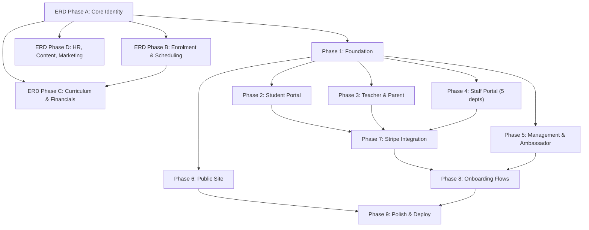

# DivergenCIE Coaching — Full-Stack Implementation Plan v4 (Approved / Final)

> **Goal:** Build a fully functioning, production-ready web platform implementing the **complete ERD v23 (~170 entities)** and all system logic. The system must be capable of **onboarding real users** — students, parents, teachers, staff, ambassadors, and management — with full data flows from enrolment through billing, scheduling, attendance, and reporting.
>
> **Deployment target:** Vercel (user has existing account + project).
> **Database:** PostgreSQL via Neon (serverless).
> **ERD is ground truth.** All other docs (PRD, UJM, MU, BDG) are subordinate.

---

## Resolved Decisions & Clarifications (v4 Finalized)

The following decisions have been finalized based on your answers to the open questions:

| Decision Area | Question Reference | Final Resolution & Action |
|---------------|--------------------|---------------------------|
| **Vercel** | — | User has existing account + project. We will require `VERCEL_PROJECT_ID` and `VERCEL_ORG_ID` for deployment settings. |
| **Auth & Invites** | **Q6** | **Credentials-only & Manual Creation:** User registration is invite-only by policy. Management/Admin creates all user accounts directly via the portal. No `InvitationToken` table. NextAuth v5 credentials provider handles login. |
| **Payment Gateways** | **Q7** | **Stripe Standard + Manual Transfers:** Stripe Checkout is used for credit/debit cards. For other local payment methods, the platform displays manual payment instructions, and the user uploads a payment receipt. Verification is handled manually by Finance supervisors. |
| **Group Classification**| **Q8** | **Follow ERD:** Keep `Group` as specified in the ERD. `Group.code` is a plain string. No lookup table for `GroupType`. |
| **Payment Reminders** | **Q9** | **Follow ERD:** Track reminder stages using the `StudentInvoice.reminderStage` integer field (stages 1-5). No extra table needed. |
| **Colour Palette** | **Q10** | **Follow BDG-v1.0:** Core brand colors are **Gold `#e8a832`** and **Navy `#1a3c5e`** (as per BDG-v1.0, which is the authority). MU-v2.0 color hex values are superseded. |
| **GDPR Consent** | **Q11** | **Defer to Phase 2:** GDPR consent tracking table (`ConsentRecord`) is deferred. For Phase 1, consent will be a simple checkbox on the manual candidate entry if needed. |
| **WhatsApp Integration**| **Q12** | **Option B (Pre-filled links):** No automated API integration. Generate `wa.me` links with pre-filled, URL-encoded messages in the portal for staff/finance to click and send manually. |
| **File Storage** | **Q13** | **Vercel Blob (Free Version) + GDrive:** Use Vercel Blob minimally for critical file uploads (manual payment receipts, candidate CVs, avatars). 99% of other resources (curriculum, booklets, certificates) will store as external links (Google Drive / Canva). |
| **Stripe Setup** | **Q14** | **Stripe Standard & Platform Invoices:** Stripe Standard (direct charges) is used. Invoices are generated only on our platform, not Stripe Billing. Card collection will run via Stripe Checkout (hosted page), which redirects parents to a secure payment page. |
| **Email/Notifications** | — | Log to database only. Email provider (Resend/SendGrid) deferred to later phases. |
| **Brand Assets** | **Q5** | Brand logos and assets are available in `/public/assets/`. |
| **ERD vs other docs** | — | ERD v23 is the single source of truth. PRD/UJM/MU/BDG are reference only. |

---

## Database Migration Path (Prisma 7 + Neon PostgreSQL)

Currently, the project is configured with Prisma 7 and SQLite. We will migrate to **PostgreSQL via Neon**.

### 1. schema.prisma Update
We will update `prisma/schema.prisma` to use the `postgresql` provider.
```prisma
datasource db {
  provider = "postgresql"
}
```

### 2. db.ts Singleton Update
We will update `src/lib/db.ts` to use `@prisma/adapter-neon` and `@neondatabase/serverless` instead of SQLite.
```ts
import "dotenv/config";
import { PrismaClient } from "@/generated/prisma";
import { Pool, neonConfig } from "@neondatabase/serverless";
import { PrismaNeon } from "@prisma/adapter-neon";
import ws from "ws";

// Enable WebSockets for serverless connections in Node.js
neonConfig.webSocketConstructor = ws;

const globalForPrisma = globalThis as unknown as {
  prisma: PrismaClient | undefined;
};

const connectionString = process.env.DATABASE_URL!;
const pool = new Pool({ connectionString });
const adapter = new PrismaNeon(pool);

const prisma =
  globalForPrisma.prisma ??
  new PrismaClient({ adapter });

if (process.env.NODE_ENV !== "production") globalForPrisma.prisma = prisma;

export default prisma;
```

---

## Cross-Document Mismatch Audit & Resolution

| # | Doc | Issue | ERD Says | Other Doc Says | Final Resolution |
|---|-----|-------|----------|----------------|------------------|
| 1 | **PRD §5.2** | Google OAuth (AUTH-02) listed as "Must Have" | No OAuth entity/field in ERD | PRD says "Must Have" | **Follow ERD — skip OAuth.** Credentials-only login. |
| 2 | **PRD §5.2** | Invitation Registration (AUTH-05) — "Admin sends invite link, user sets password" | No `InvitationToken` entity in ERD | PRD says "Must Have" | **Follow ERD — skip table.** Direct user creation by management. |
| 3 | **PRD §5.14** | Multi-gateway payments (FPX, DuitNow, Razorpay, EasyPaisa, Al Rajhi) | ERD only has Stripe fields | PRD lists 6+ gateways as "Must Have" | **Follow ERD + Manual uploads.** Stripe Standard handles cards. Display bank instructions for regional gateways and accept manual receipt uploads. |
| 4 | **PRD §5.3** | Study Plan (STU-18) — "monthly milestones, weekly task list, exam countdown" | No `StudyPlan` entity in ERD | PRD says "Should Have (P2)" | **Follow ERD — defer.** No entity needed for P1. |
| 5 | **PRD §5.6** | PR Schedule Manager — B/C/T group classification | ERD has `Group.code` plain string | PRD says group codes are business-critical | **Follow ERD.** Plain `Group.code` string, no lookup table. |
| 6 | **UJM §8** | PR/Ops: conflict-check overlap flags | No explicit constraint in ERD | UJM requires conflict detection | **Application logic.** Query overlapping `ScheduleOccurrence` ranges. |
| 7 | **PRD §5.8** | Finance: 5-stage WhatsApp reminders | No `ReminderStage` table in ERD | PRD lists as "Must Have" | **Follow ERD.** Use existing `StudentInvoice.reminderStage` integer. |
| 8 | **MU §7.5** | Rich Text Editor for announcements/tickets | ERD stores `Announcement.body` as plain string | MU specifies Quill/TipTap | **Frontend concern.** Store formatted HTML/markdown inside the string. |
| 9 | **PRD §5.11** | Ambassador Application Form — public | ERD has `RegistrationFormEntry` | PRD says dedicated ambassador form | **Use ERD.** Form entry with `targetUserTypeId` set to "AMBASSADOR". |
| 10| **BDG** | Colour palette mismatch | — | BDG says Gold `#e8a832` | MU says Gold `#C9922A` | **Follow BDG.** Color hex values are Gold `#e8a832` and Navy `#1a3c5e`. |
| 11| **PRD §6** | GDPR consent flows | No GDPR entity in ERD | PRD says GDPR-compliant | **Mark as later todo.** Defer `ConsentRecord` table. |
| 12| **UJM §5** | Teacher "Protocols Library" | No `ProtocolDocument` table in ERD | UJM/PRD say "Must Have" | **Use ERD.** Model protocols as `ContentBankItem` filtered by dept. |

---

## ERD Phased Implementation

The complete ERD v23 has **~170 entities**. It is split into **4 sub-phases** by domain.

### ERD Phase A — Core Identity & Organisation (~30 entities)
Foundation entities that everything else depends on.
```
LOOKUP TABLES (19):
  Department, StaffRole, UserType, SessionType, TicketType,
  NotificationType, FlagType, RecordType, MockType,
  AmbassadorTestType, OutreachSource, SocialPlatformType,
  SocialPostType, CampaignTag, ContentType, OutreachType,
  ExhibitionType, TaskType, PaymentMethodType

USERS & PROFILES (6):
  User, StudentProfile, TeacherProfile, StaffProfile,
  AmbassadorProfile, ParentProfile

ORGANISATION (4):
  Group, Service, Booklet, BillingMonth
```

### ERD Phase B — Enrolment, Scheduling & Sessions (~55 entities)
The operational core: how users get enrolled, scheduled, and attend.
```
ENROLMENTS (16 + Discount):
  StudentEnrolmentList, StudentEnrolmentItem, StudentEnrolmentItemStatusChangeLog
  TeacherEnrolmentList, TeacherEnrolmentItem, TeacherEnrolmentItemStatusChangeLog
  StaffEnrolmentList, StaffEnrolmentItem, StaffEnrolmentItemStatusChangeLog
  AmbassadorEnrolmentList, AmbassadorEnrolmentItem, AmbassadorEnrolmentItemStatusChangeLog
  Discount

RATES (3):
  RateList, RateItem (+ RateItemStatusChangeLog), RateChangeLog

SCHEDULES (12):
  ServiceSchedule, ScheduleOccurrence, ScheduleOccurrenceStatusChangeLog, ScheduleChangeRequest
  StaffServiceSchedule, StaffScheduleOccurrence, StaffScheduleOccurrenceStatusChangeLog, StaffScheduleChangeRequest
  AmbassadorServiceSchedule, AmbassadorScheduleOccurrence, AmbassadorScheduleOccurrenceStatusChangeLog, AmbassadorScheduleChangeRequest

SESSIONS & ATTENDANCE (8):
  AcademicSession, AcademicSessionStatusChangeLog, SessionAttendance
  Meeting, MeetingStatusChangeLog, MeetingAttendance
  AmbassadorMeeting, AmbassadorMeetingStatusChangeLog, AmbassadorMeetingAttendance

STAFF/AMBASSADOR SERVICE (2):
  StaffService, AmbassadorService

GCR (2):
  GcrList, GcrItem

CALENDAR (1):
  CalendarItem
```

### ERD Phase C — Curriculum, Financials & Tickets (~60 entities)
Academic content, invoicing, paychecks, ticket routing, and commission.
```
CURRICULUM — STUDENT (17):
  CurriculumList, SyllabusList, SyllabusListStatusChangeLog
  SyllabusChapter, SyllabusItem, StudentSyllabusProgress
  TaskList, TaskListStatusChangeLog, TaskItem, TaskAssignment, TaskSubmission
  MockList, MockListStatusChangeLog, MockItem, MockResult
  CourseTimelineList, CourseTimelineListStatusChangeLog, CourseTimelineItem
  ChapterRecordingList, ChapterRecordingItem, Doubt

CURRICULUM — AMBASSADOR (10):
  AmbassadorProgrammeList, AmbassadorProgrammeContentList, AmbassadorProgrammeContentListStatusChangeLog
  AmbassadorProgrammeItem, AmbassadorProgrammeProgress
  AmbassadorTestList, AmbassadorTestListStatusChangeLog, AmbassadorTestItem, AmbassadorTestResult
  AmbassadorProgrammeTimelineList, AmbassadorProgrammeTimelineListStatusChangeLog, AmbassadorProgrammeTimelineItem

INVOICING (4):
  StudentInvoice, InvoiceLineItem, StudentInvoiceStatusChangeLog

CLAIMS & PAYCHECKS — TEACHER/STAFF (8):
  Claim, ClaimLineItem, ClaimStatusChangeLog
  Paycheck, PaycheckLineItem, PaycheckStatusChangeLog

CLAIMS & PAYCHECKS — AMBASSADOR (6):
  AmbassadorClaim, AmbassadorClaimLineItem, AmbassadorClaimStatusChangeLog
  AmbassadorPaycheck, AmbassadorPaycheckStatusChangeLog
  AmbassadorCommissionList, AmbassadorCommissionItem, AmbassadorCommissionItemStatusChangeLog, AmbassadorCommissionRateChangeLog

PAYMENTS (5):
  PaymentMethodType, PaymentMethod, BankAccount, PaymentRecord (contains receiptUrl)

FINANCE (5):
  AccountTransaction, LedgerEntry, DeptBudget, BudgetSubCategory, BudgetUtilisation

TICKETS (4):
  Ticket, TicketMessage, TicketHistory, TicketPermission

REFERRALS (2):
  Referral, ReferralClick
```

### ERD Phase D — HR, Content, Marketing, Metrics & RBAC (~30 entities)
Supporting systems, checklists, candidate tracking, and marketing tools.
```
PRE-HIRE (4):
  Candidate, JobPosting, RegistrationForm, RegistrationFormEntry

HR & FLAGS (6):
  StudentRecord, TeacherRecord, StaffRecord, AmbassadorRecord, StudentFlag

CONTENT & KNOWLEDGE (7):
  ContentGroup, ContentGroupItem, ContentBankItem
  KnowledgeBankDomain, KnowledgeBankList, KnowledgeBankItem

NOTIFICATIONS (2):
  Notification, Announcement

CHECKLISTS (4):
  ChecklistTemplate, ChecklistTemplateItem, ChecklistEntry, ChecklistItemEntry

MARKETING (9):
  MarketingSchedule, MarketingScheduleOccurrence, MarketingScheduleOccurrenceStatusChangeLog
  MarketingPostSlot, MarketingPost
  Campaign, CampaignItem, OutreachItem, ExhibitionItem, Lead

BACKLOG (7):
  OrgBacklogBank, BacklogItem, BacklogItemChangeLog
  MeetingSprintList, MeetingSprintItem, MeetingBacklogList, MeetingBacklogItem

MEETINGS (3):
  GeneralMeeting, GeneralMeetingStatusChangeLog, MeetingParticipant

MISC (5):
  Recording, SiteLog, AccessLog, CurrencyRate, TextFormat

METRICS & REPORTS (2):
  MetricSnapshot, ProgressReport

RBAC (1):
  PortalPermission
```

---

## Build Phases (Frontend + API)

### Phase 1 — Foundation (DB + Design System + Auth)
- **Database:** Migrate SQLite to Neon PostgreSQL. Implement all schema tables. Seed all lookups and 19 demo users with profiles.
- **Design System:** Implement CSS custom properties using BDG colors (`Gold: #e8a832`, `Navy: #1a3c5e`). Create reusable inputs, cards, tables, calendars, and badges.
- **Auth:** NextAuth v5 credentials provider. JWT stores role + dept. Dynamic middleware route protection. Split layout login.
- **Portal Shell:** Sidebar navigation with permissions filtering, topbar, theme toggle (stored in localStorage key `dc-theme`).

### Phase 2 — Student Portal (7 pages)
- **Dashboard:** Unified dashboard with CalendarItems, announcements, and task checklist entries.
- **Classes:** AcademicSession schedule tracking, attendance logs, whiteboard links, and recordings.
- **Assignments:** TaskItem list, deadline reminders, and file submissions.
- **Recordings:** Searchable chapter video recording archive.
- **Progress:** Syllabus mastery rates and raise doubt workflow.
- **Mock Solver:** Solves MockItems, displays detailed results.
- **Support:** Ticketing creation & message threads.

### Phase 3 — Teacher & Parent Portals
- **Teacher Portal (4 pages):** Dashboard class schedule, log student attendance, claims line item submission, student progress reviews, and ticket replies.
- **Parent Portal (4 pages):** Dashboard child summary, syllabus masteries, mock results, parent ticket submissions, and invoice views (launch Stripe Checkout or upload bank transfer receipts to Vercel Blob).

### Phase 4 — Staff Portal (5 dashboards + shared)
- **Shared:** Global support ticket board, content bank libraries.
- **PR/Ops:** Group allocations, calendar schedule request approvals, conflict checking, student flags, no-show alerts.
- **HR:** Candidate hiring pipeline stages, staff records (salary, onboarding checklist).
- **Finance:** Rate card management, claim approvals, manual receipt verification (approve uploaded receipts), budget utilization ledgers.
- **Marketing:** Lead generation logs, marketing post scheduler, campaign ROI snapshots.
- **IT:** Permission overrides, access logs tracker.

### Phase 5 — Management & Ambassador Portals
- **Management:** High-level metrics snap weekly line charts, approve staff claims, budgets summaries.
- **Ambassador:** Referral program dashboard, custom referral codes, allowance claims, commission claim lines breakdown.

### Phase 6 — Public Site (8 pages)
- Landing, About, Services Hub (6 courses), Careers, Contact, Resources, Pricing (country-adaptive methods), Mock Simulator with lead capture.

### Phase 7 — Stripe Integration & Manual Verification
- Integrate Stripe Node.js SDK (Stripe Standard).
- Parents select payment option: Card (launches Stripe Checkout hosted page) or Manual local transfer.
- For manual transfers, parent uploads invoice receipt -> stores in Vercel Blob -> updates `PaymentRecord` to `PENDING_VERIFICATION`.
- Finance dashboard reviews the receipt image and hits "Approve" -> `PaymentRecord` changes to `SUCCESSFUL`, invoice changes to `PAID`, LedgerEntry transaction auto-generates.
- Webhooks handle card payments (`payment_intent.succeeded` updates database records automatically).

### Phase 8 — Onboarding Flows (Gates)
- **Student Onboarding:** Checks four flags (`gcrAssigned`, `groupAssigned`, `scheduleAssigned`, `financeApprovedFlag`). All four must be true to transition profile status to `ACTIVE` and unlock portal.
- **Teacher Onboarding:** Complete assigned checklist templates to activate profile.

### Phase 9 — Polish, Testing & Deployment
- Responsive checking across 5 breakpoints.
- Run unit and integration tests (Vitest).
- Deploy codebase to Vercel, link Neon PostgreSQL production pool, configure env vars.

---

## Technology Stack

| Layer | Technology | Notes |
|-------|-----------|-------|
| Framework | Next.js 15 (App Router) | Standard App Router |
| Language | TypeScript | Type safety |
| Database | PostgreSQL via Neon | Serverless Postgres client |
| ORM | Prisma 7.x | Switch provider to `postgresql` |
| Auth | NextAuth v5 | Credentials-only |
| Styling | Tailwind CSS v4 + CSS vars | Custom properties inside `globals.css` |
| File Storage| Vercel Blob (Free tier) | Used for receipts and profile images |
| Payments | Stripe Standard | Card collection via Stripe Checkout |
| Charts | Recharts | Render dashboards statistics |
| Testing | Vitest | Configured unit tests |

---

## Verification Plan

### Per-Phase Verification
- **ERD Phases:** `prisma migrate dev` succeeds. `prisma db seed` seeds lookup values and test data.
- **Foundation:** Dynamic login redirect per role. Unauthenticated routes redirect to login.
- **Student/Teacher/Parent Portal:** Check CRUD operations, scheduling, progress data, doubts, and ticket logs.
- **Finance Receipts Flow:**
  1. Parent logs manual payment upload -> Vercel Blob link stored.
  2. Finance supervisor verifies receipt image -> clicks "Approve".
  3. Invoice marked PAID, `PaymentRecord` status updates to `SUCCESSFUL`.
- **Onboarding Gates:** Confirm student status remains `PAUSED` until all 4 verification flags are true.
- **Production Build:** Build passes and deploys cleanly to Vercel.

---

## Build Dependency Graph



---

## SWE Skill Compliance

| Practice | Implementation |
|----------|---------------|
| **Git** | GitHub Flow. Feature branches. Conventional Commits. |
| **Secrets** | `planning/keys.md` excluded via `.gitignore`. Environment variables. |
| **Quality Gates** | 5-Lens review on each phase completion. |
| **Visual Quality** | Loop of Render -> Critique -> Rewrite. BDG color palette values enforced. |

---

## File Structure (Target)

```
src/
├── app/
│   ├── (public)/              # Public marketing site
│   │   ├── page.tsx           # Landing
│   │   ├── about/
│   │   ├── services/[slug]/
│   │   ├── pricing/
│   │   ├── careers/
│   │   ├── contact/
│   │   ├── resources/
│   │   └── mock/
│   ├── auth/
│   │   └── login/
│   ├── portal/
│   │   ├── student/
│   │   │   ├── dashboard/
│   │   │   ├── classes/
│   │   │   ├── assignments/
│   │   │   ├── recordings/
│   │   │   ├── progress/
│   │   │   ├── mock-solver/
│   │   │   └── support/
│   │   ├── parent/
│   │   │   ├── dashboard/
│   │   │   ├── progress/
│   │   │   ├── fees/
│   │   │   └── support/
│   │   ├── teacher/
│   │   │   ├── dashboard/
│   │   │   ├── students/
│   │   │   ├── claims/
│   │   │   └── tickets/
│   │   ├── staff/
│   │   │   ├── dashboard/         # Shared staff dashboard
│   │   │   ├── tickets/
│   │   │   ├── content-bank/
│   │   │   ├── meetings/
│   │   │   ├── attendance/
│   │   │   ├── claims/
│   │   │   ├── pr/                # PR/Ops dept pages
│   │   │   ├── hr/                # HR dept pages
│   │   │   ├── finance/           # Finance dept pages
│   │   │   ├── marketing/         # Marketing dept pages
│   │   │   └── it/                # IT dept pages
│   │   ├── ambassador/
│   │   │   ├── dashboard/
│   │   │   ├── referrals/
│   │   │   ├── deliverables/
│   │   │   ├── earnings/
│   │   │   ├── completion/
│   │   │   └── support/
│   │   └── management/
│   │       ├── dashboard/
│   │       ├── claims/
│   │       ├── budget/
│   │       ├── metrics/
│   │       ├── tickets/
│   │       ├── users/
│   │       ├── meetings/
│   │       └── content-bank/
│   ├── api/                   # API routes
│   │   ├── auth/
│   │   ├── users/
│   │   ├── enrolments/
│   │   ├── sessions/
│   │   ├── tickets/
│   │   ├── invoices/
│   │   ├── claims/
│   │   ├── schedules/
│   │   ├── curriculum/
│   │   ├── notifications/
│   │   ├── metrics/
│   │   ├── payments/
│   │   │   └── webhook/       # Stripe webhook
│   │   └── lookup/
│   └── globals.css
├── components/
│   ├── ui/                    # Design system components
│   └── portal/                # Portal shell components
├── lib/
│   ├── db.ts                  # Prisma client (Neon)
│   ├── auth.ts                # NextAuth config
│   ├── permissions.ts         # RBAC resolution
│   ├── stripe.ts              # Stripe client
│   └── actions/               # Server actions by domain
├── types/
│   └── index.ts               # Shared TypeScript types
│   └── next-auth.d.ts         # NextAuth type declaration overrides
└── middleware.ts              # Route protection
```
