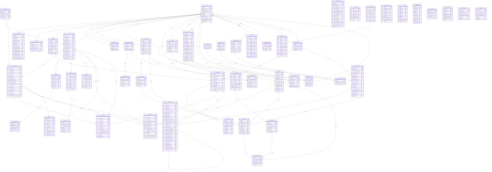

```mermaid
erDiagram

  %% ─── USERS & PROFILES ───────────────────────────────────────────

  User ||--o| StudentProfile : "has"
  User ||--o| TeacherProfile : "has"
  User ||--o| StaffProfile : "has"
  User ||--o| ParentProfile : "has"
  User ||--o| AmbassadorProfile : "has"
  User ||--o{ BankAccount : "owns"
  User ||--o{ User : "parent of"
  User ||--o{ Service : "teaches"
  User ||--o{ Claim : "submits"
  User ||--o{ Referral : "refers"
  User ||--o{ Ticket : "creates"
  User ||--o{ Ticket : "assigned"
  User ||--o{ TicketMessage : "sends"
  User ||--o{ TicketHistory : "acts"
  User ||--o{ MeetingParticipant : "attends"
  User ||--o{ ContentBankItem : "adds"
  User ||--o{ SiteLog : "logged"
  User ||--o{ Announcement : "targeted"

  User {
    cuid id PK
    string email UK
    string passwordHash
    string photo
    string bio
    bool isActive
    string referralCode
    string whatsappNumber
    string country
  }

  StudentProfile {
    cuid id PK
    cuid userId FK
    string status
    string mainCurrency
    string timeZone
    string notes
    string referredBy
    string timesheetURL
    string scheduleURL
    string progressTrackerURL
    bool gcrAssigned
    bool groupAssigned
    bool scheduleAssigned
    bool financeApprovedFlag
  }

  TeacherProfile {
    cuid id PK
    cuid userId FK
    string teachingProfileUrl
    bool idDocProvided
    bool salaryAccountProvided
  }

  StaffProfile {
    cuid id PK
    cuid userId FK
    string roleTitle
    string salaryType
    float salaryRate
    string role
    string dept
    bool isSupervisor
  }

  ParentProfile {
    cuid id PK
    cuid userId FK
    string phone
    string address
  }

  AmbassadorProfile {
    cuid id PK
    cuid userId FK
    string cohort
    string referralCode UK
  }

  %% ─── GROUPS & SERVICES ──────────────────────────────────────────

  Group ||--o{ Service : "hosts"
  Group ||--o{ AcademicSession : "runs"

  Service ||--o{ Enrollment : "has"
  Service ||--o{ AcademicSession : "covers"
  Service ||--o{ SyllabusItem : "has"
  Service ||--o{ Assignment : "for"
  Service ||--o{ MockResult : "for"
  Service ||--o{ ClaimLineItem : "billed via"
  Service ||--o{ Recording : "has"
  Service ||--o{ Attendance : "tracks"

  Group {
    cuid id PK
    string code UK
    string groupCategory
    string status
    bool isActive
  }

  Service {
    cuid id PK
    cuid groupId FK
    cuid teacherId FK
    string board
    string courseLevel
    string subjectCode
    string subjectName
    string serviceType
    string currency
    float clientRate
    float staffRate
    bool isHourly
    string teacherIdSnapshot
    bool isActive
  }

  %% ─── ENROLLMENT ─────────────────────────────────────────────────

  User ||--o{ EnrollmentGroup : "has"
  EnrollmentGroup ||--o{ Enrollment : "contains"
  EnrollmentGroup ||--o{ StudentInvoice : "generates"

  Enrollment ||--o{ Discount : "has"
  Enrollment ||--o{ Attendance : "tracks"
  Enrollment ||--o{ InvoiceLineItem : "billed via"

  EnrollmentGroup {
    cuid id PK
    cuid studentId FK
    string serviceType
    bool isActive
  }

  Enrollment {
    cuid id PK
    cuid enrollmentGroupId FK
    cuid studentId FK
    cuid serviceId FK
    string status
    bool trialRequired
    datetime startDate
    datetime endDate
    float expectedHoursPerMonth
    bool isActive
  }

  Discount {
    cuid id PK
    cuid studentId FK
    cuid enrollmentId FK
    string discountType
    float value
    bool isPct
    string code
    bool isActive
  }

  %% ─── SESSIONS & ATTENDANCE ──────────────────────────────────────

  AcademicSession ||--o{ Attendance : "records"
  AcademicSession ||--o{ InvoiceLineItem : "billed as"
  AcademicSession ||--o{ ClaimLineItem : "claimed as"
  AcademicSession ||--o{ Recording : "recorded as"

  AcademicSession {
    cuid id PK
    cuid groupId FK
    cuid teacherId FK
    cuid serviceId FK
    string topic
    datetime startTime
    datetime endTime
    datetime originalStartTime
    datetime originalEndTime
    float durationHours
    bool isTrial
    string status
    string sessionMode
    string zoomLink
    string wbLink
    string wbName
    string timesheetSubmissionStatus
  }

  Attendance {
    cuid id PK
    cuid sessionId FK
    cuid serviceId FK
    cuid studentId FK
    cuid enrollmentId FK
    string status
    float durationHours
    int noShowCount
    bool changeRequestPending
    string changeRequestStatus
    string notes
    datetime markedAt
  }

  %% ─── INVOICING ──────────────────────────────────────────────────

  StudentInvoice ||--o{ InvoiceLineItem : "contains"
  StudentInvoice ||--o{ LedgerEntry : "references"
  InvoiceMonth ||--o{ StudentInvoice : "period"
  InvoiceLineItem ||--o| InvoiceLineItem : "corrects"

  InvoiceMonth {
    cuid id PK
    string month UK
  }

  StudentInvoice {
    cuid id PK
    cuid studentId FK
    cuid enrollmentGroupId FK
    cuid invoiceMonthId FK
    string month
    string invoiceMode
    float subtotal
    float discountApplied
    float netAmount
    float dueAmount
    string currency
    string status
    int reminderStage
    string stripePaymentIntentId
    string stripeStatus
    bool isActive
    string notes
  }

  InvoiceLineItem {
    cuid id PK
    cuid invoiceId FK
    string lineType
    cuid enrollmentId FK
    cuid academicSessionId FK
    datetime sessionDate
    datetime sessionStart
    datetime sessionEnd
    datetime originalSessionStart
    datetime originalSessionEnd
    string attendanceStatusSnapshot
    bool isTrialSession
    float sessionHours
    float rateSnapshot
    string groupCodeSnapshot
    string teacherNameSnapshot
    string serviceNameSnapshot
    cuid originalInvoiceId FK
    cuid originalLineItemId FK
    string correctionReason
    datetime originalSessionDate
    float correctionAmount
    string description
    float originalAmount
    string originalCurrency
    float conversionRateUsed
    float convertedAmount
  }

  %% ─── TEACHER PAYROLL ────────────────────────────────────────────

  Claim ||--o{ ClaimLineItem : "contains"
  Claim ||--o{ LedgerEntry : "references"
  Claim ||--o{ BudgetUtilisation : "triggers"

  Claim {
    cuid id PK
    cuid userId FK
    string month
    string dept
    int sessions
    float hours
    float amount
    string currency
    string status
    string notes
    bool isActive
  }

  ClaimLineItem {
    cuid id PK
    cuid claimId FK
    cuid serviceId FK
    cuid academicSessionId FK
    datetime sessionDate
    datetime sessionStart
    datetime sessionEnd
    float sessionHours
    float staffRateSnapshot
    float lineTotal
    string currency
    string serviceNameSnapshot
    string groupCodeSnapshot
  }

  %% ─── FINANCE ────────────────────────────────────────────────────

  BankAccount ||--o{ AccountTransaction : "records"
  BankAccount ||--o{ LedgerEntry : "affected"
  BankAccount ||--o{ DeptBudget : "funds"
  AccountTransaction ||--o{ LedgerEntry : "splits"
  DeptBudget ||--o{ BudgetSubCategory : "has"
  BudgetSubCategory ||--o{ BudgetUtilisation : "consumed"
  LedgerEntry ||--o{ BudgetUtilisation : "linked"

  BankAccount {
    cuid id PK
    cuid ownerId FK
    bool isDcAccount
    string label
    string purpose
    string currency
    float currentBalance
    bool isActive
  }

  AccountTransaction {
    cuid id PK
    cuid bankAccountId FK
    string description
    string transactionType
    float amount
  }

  LedgerEntry {
    cuid id PK
    cuid transactionId FK
    cuid bankAccountId FK
    float amount
    string direction
    string purpose
    cuid studentInvoiceId FK
    cuid claimId FK
  }

  DeptBudget {
    cuid id PK
    string dept
    string quarter
    float totalAllocated
    string status
    cuid bankAccountId FK
    datetime quarterStart
    datetime quarterEnd
    bool isActive
  }

  BudgetSubCategory {
    cuid id PK
    cuid budgetId FK
    string subCategoryType
    float allocated
    float utilised
    float remaining
  }

  BudgetUtilisation {
    cuid id PK
    cuid subCategoryId FK
    cuid ledgerEntryId FK
    string referenceType
    float amount
  }

  %% ─── TICKETS ────────────────────────────────────────────────────

  Ticket ||--o{ TicketMessage : "contains"
  Ticket ||--o{ TicketHistory : "records"

  Ticket {
    cuid id PK
    string displayId UK
    string title
    string description
    string status
    string priority
    cuid creatorId FK
    cuid assigneeId FK
    string department
    string originalDept
    string ticketType
    string attachmentLink
    bool isConfidential
    bool isActive
    string routingStack
    string meta
  }

  TicketMessage {
    cuid id PK
    cuid ticketId FK
    cuid senderId FK
    string body
    bool isInternal
    string attachmentLink
  }

  TicketHistory {
    cuid id PK
    cuid ticketId FK
    cuid actorId FK
    string action
    string meta
  }

  TicketPermission {
    cuid id PK
    string department UK
    bool canTargetStudent
    bool canTargetParent
    bool canTargetTeacher
    bool canTargetAmbassador
    bool canTargetCandidate
    bool canTargetPR
    bool canTargetIT
    bool canTargetHR
    bool canTargetFinance
    bool canTargetMarketing
    bool canTargetManagement
    bool isInternalOnly
  }

  %% ─── ACADEMIC ───────────────────────────────────────────────────

  SyllabusItem ||--o{ StudentProgress : "tracked"
  SyllabusItem ||--o{ Doubt : "tagged"

  SyllabusItem {
    cuid id PK
    cuid serviceId FK
    string chapterNum
    string title
    string milestone
    int order
    bool isActive
  }

  StudentProgress {
    cuid id PK
    cuid studentId FK
    cuid syllabusItemId FK
    bool completed
    int masteryPct
  }

  Doubt {
    cuid id PK
    cuid studentId FK
    cuid syllabusItemId FK
    string body
    string response
    string status
  }

  MockResult {
    cuid id PK
    cuid studentId FK
    cuid serviceId FK
    float score
    float maxScore
    string topic
    datetime takenAt
  }

  Assignment {
    cuid id PK
    cuid studentId FK
    cuid serviceId FK
    string title
    string description
    datetime dueDate
    string status
    string grade
    string submission
  }

  %% ─── CONTENT & ANNOUNCEMENTS ────────────────────────────────────

  ContentGroup ||--o{ ContentGroupItem : "contains"
  ContentBankItem ||--o{ ContentGroupItem : "belongs to"

  ContentGroup {
    cuid id PK
    string name
    string dept
    bool isActive
  }

  ContentGroupItem {
    cuid id PK
    cuid contentGroupId FK
    cuid contentBankItemId FK
  }

  ContentBankItem {
    cuid id PK
    string dept
    string name
    string url
    cuid addedByUserId FK
    bool isActive
  }

  Announcement {
    cuid id PK
    string title
    string body
    string targets
    string targetDept
    cuid targetUserId FK
    string priority
    bool emailSent
    datetime createdAt
    datetime expiresAt
    bool isActive
  }

  %% ─── RECORDINGS ─────────────────────────────────────────────────

  Recording {
    cuid id PK
    cuid serviceId FK
    cuid sessionId FK
    string title
    string subject
    string videoUrl
    datetime date
    float durationHours
    string category
    bool isActive
  }

  %% ─── LOGGING ────────────────────────────────────────────────────

  SiteLog {
    cuid id PK
    cuid userId FK
    string action
    string entityType
    string entityId
    string ipAddress
    string userAgent
    string device
    string country
    json metaBefore
    json metaAfter
    datetime createdAt
  }

  AccessLog {
    cuid id PK
    cuid staffId FK
    string toolName
    string credential
    datetime dateGranted
    bool revoked
    string notes
  }

  %% ─── MEETINGS ───────────────────────────────────────────────────

  Meeting ||--o{ MeetingParticipant : "has"

  Meeting {
    cuid id PK
    string title
    datetime dateTime
    string agenda
    string status
    string link
    string dept
    bool isActive
  }

  MeetingParticipant {
    cuid id PK
    cuid meetingId FK
    cuid userId FK
    string rsvp
  }

  %% ─── AMBASSADOR & REFERRALS ─────────────────────────────────────

  AmbassadorProfile ||--o{ AmbassadorDeliverable : "submits"
  AmbassadorProfile ||--o{ AmbassadorEarning : "earns"
  Referral ||--o{ AmbassadorEarning : "generates"

  Referral {
    cuid id PK
    cuid referrerId FK
    cuid referredStudentId FK
    string code
    string status
    bool isActive
  }

  AmbassadorDeliverable {
    cuid id PK
    cuid ambassadorId FK
    string title
    float score
    string status
  }

  AmbassadorEarning {
    cuid id PK
    cuid ambassadorId FK
    string earningType
    float amount
    string currency
    string payoutStatus
  }

  %% ─── MISC ───────────────────────────────────────────────────────

  MarketingPost {
    cuid id PK
    string contentType
    string status
    string canvaLink
    string driveLink
    string caption
    datetime scheduledDate
    string campaignTag
    bool isActive
  }

  Lead {
    cuid id PK
    string name
    string email
    string phone
    string source
    string status
    string notes
    bool passedToPR
    bool isActive
  }

  Candidate {
    cuid id PK
    string email UK
    string name
    string role
    string status
    string cvLink
    string docsLink
    string notes
    string outreach
    bool isActive
  }

  CurrencyRate {
    cuid id PK
    string fromCurrency
    string toCurrency
    float rate
    float reverseRate
  }

  TextFormat {
    cuid id PK
    string name UK
    string text
    string alternateText1
    string alternateText2
    date dateAdded
    string use
  }

  BacklogItem {
    cuid id PK
    int serialNo
    string addedToCalendar
    string addedToCalendar2
    string event
    string desc
  }

  SprintItem {
    cuid id PK
    int serialNo
    string addedToCalendar
    string addedToCalendar2
    string event
    string desc
  }
```
